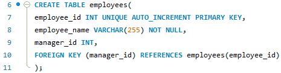
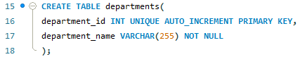
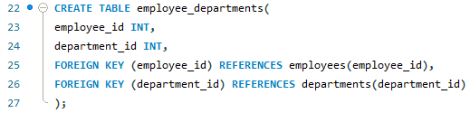
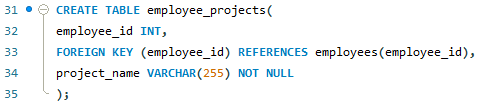
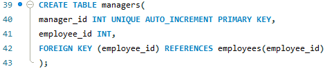

# Finals Task 1. Multi Level Company Database 

## Here's the screenshot of Query Statements (See screenshot)
- TASK 1

- TASK 2

- TASK 3

- TASK 4

- TASK 5

## Here's the screenshot of Table Structure (See screenshot)

## Here's the ER Diagram or Relational schema 

## Sql copy of the database and table sturctures

