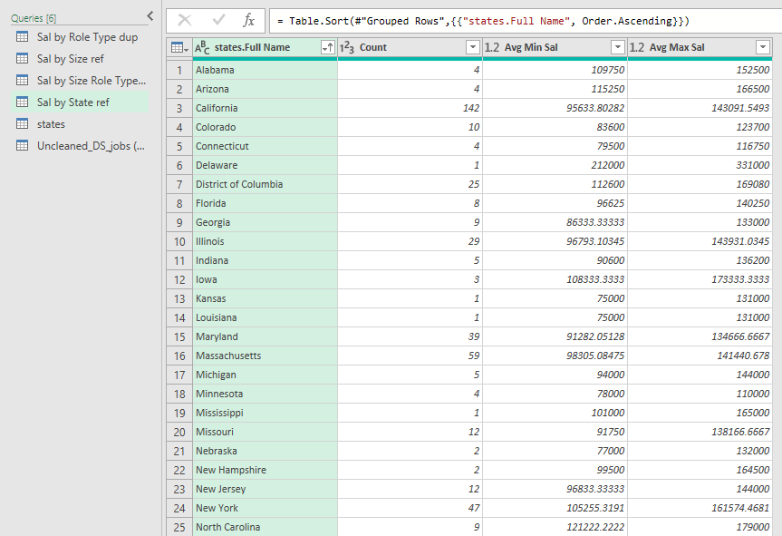

# Midterm Lab task 2 - Data Cleaning and Transformation using POWER QUERY
For this task, we are given Flat data from Excel (See raw file) and we are Task to perform Data Cleaning and Preparation 
## Data Cleaning Process
- Load the raw file
- Fit Column and row width and height
- TRIM extra spaces
- Remove NULL values
- Remove Duplicates
## Normalization
- Performed 1NF
- Perform Table split using 2NF
- Perform 3 NF
- Mapped the Normalized tables as a Physical Data Model
## Here's the screenshot of my output before doing Cleaning and Transformation (See screenshot)

## Here's the screenshots of my final output (See screenshots)
- Sal by Role Type

- Sal by Size

- Sal by Size Role Type

- Sal by State

## Here's the Physical Data Model

